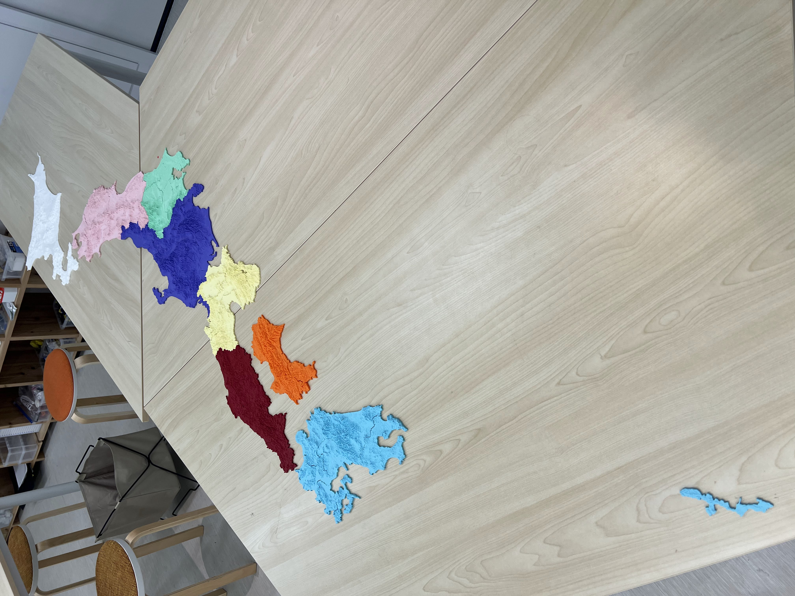
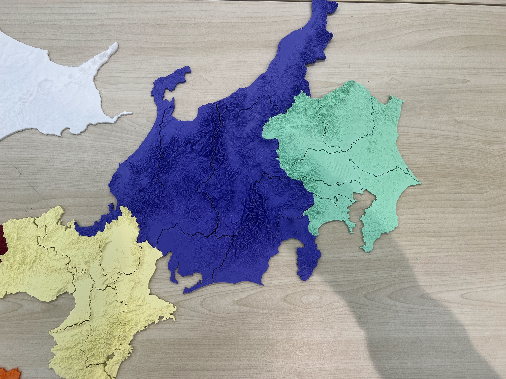
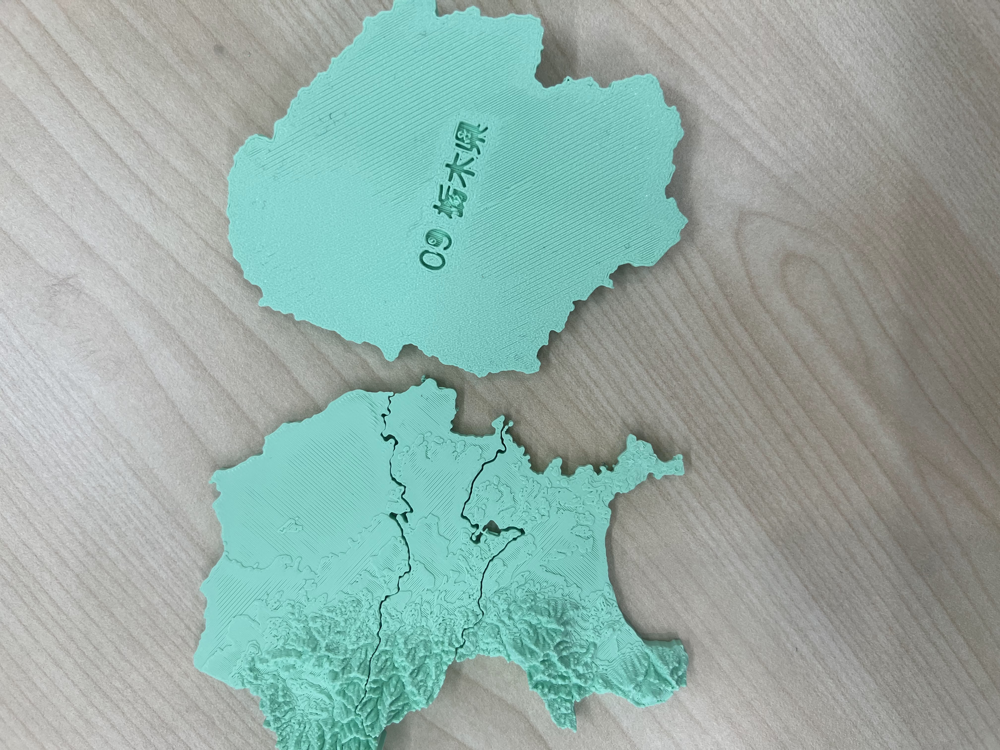

# 3D 都道府県パズル

国土地理院の数値標高モデル（DEM）と国土交通省の行政区域データから生成した、都道府県の地形 3D プリント用 STL ファイルを配布するサイトです。

🌐 **サイト**: https://tukumanalab.github.io/pref-puzzle/

## ギャラリー

複数地方を組み合わせた全体の様子。



関東・中部・近畿などの地形ピース。標高に応じた起伏や河川・境界線が再現されています。



各ピース裏面には県コード・都道府県名・県庁所在地を彫刻（裏面から読めるよう左右ミラー反転）。



## 特徴

- 北海道（4地方）・関東・中部・近畿・中国・四国 の地形 STL
- ブラウザ上で 3D プレビュー（Three.js）
- 個別ダウンロード / ZIP 一括ダウンロード
- 各ピース裏面に県コード・都道府県名・県庁所在地を彫刻

## STL パラメータ

| パラメータ | 値 |
|------------|-----|
| XY スケール | 1/1107（統一縮尺） |
| Z スケール | 5.0 |
| ベース厚 | 3mm |
| 境界クリアランス | 約 0.3mm/辺 |
| 解像度（通常） | zoom=12 / decimation=4（約 120m メッシュ） |
| 解像度（北海道） | zoom=11 / decimation=16（約 480m メッシュ） |

## STL 生成ロジック（`scripts/gen_stl.py`）

### 1. DEM タイル取得

国土地理院の XYZ タイル形式 DEM（`dem/{z}/{x}/{y}.txt`）を、`PUZZLE_BBOXES` で定義した各都道府県の矩形範囲に必要なタイルすべてを並列ダウンロードし、1 枚のグリッドに結合する。タイルはローカルに `public/data/dem/{z}/{x}/{y}.bin` としてキャッシュされ、再実行時は再ダウンロードしない。

### 2. 境界ポリゴンのマスク生成（PIL OR 合算）

N03-2024 行政区域データは「振興局」「市区町村」など複数の階層ポリゴンが重複して格納されている。スキャンライン偶奇ルール（even-odd）で合算すると隣接ポリゴンの共有頂点が互いに打ち消し合い、マスクが 0 になるバグが生じる。

このため各ポリゴンを PIL の `ImageDraw.polygon(fill=255)` で**個別に描画**して OR 合算するマスク方式を採用している。重複領域も正しく 255 のまま残り、全体の外形が正確に塗りつぶされる。

### 3. 飛び地・島の除外（Union-Find）

境界データには離島や飛び地のポリゴンも含まれる。本土を自動選択するため、**外周の座標点を共有するポリゴンを隣接**とみなし、Union-Find で連結成分を構築する。面積合計が最大の連結成分を本土と判定し、それ以外のポリゴンを除外する。

> 北海道コードは `coord_decimals=4`（丸め精度 ≈ 10m）を使用。標準の 5（≈ 1m）ではポリゴン間の座標誤差で連結が切れるケースがあるため。

### 4. 境界クリアランス

マスクを 8 ピクセル（約 0.3mm）内側に縮小（マンハッタン侵食）することで、隣接ピース間に印刷クリアランスを確保する。

### 5. 座標変換とスケール

タイルグリッドの経緯度座標を以下の式で STL 座標（mm）に変換する。

```
wx = (lon - 139.0) × cos(36°) × 111320 × XY_SCALE
wy = (lat - 36.0) × 111320 × XY_SCALE
wz = 標高(m) × Z_SCALE × XY_SCALE
```

`XY_SCALE = 1.5 / 1660`（≈ 1/1107）は全地方で統一。北海道は面積が大きいため zoom=11 / decimation=16 で解像度を下げてファイルサイズを抑制している。

### 6. メッシュ生成

STL は 4 種類のメッシュを結合して構成される。

| メッシュ | 内容 |
|----------|------|
| 地形（上面） | decimation×decimation ピクセルを 1 セルとして 2 三角形に分割。海抜 0m 未満は 0m に補完。 |
| 壁（側面） | 有効セルと無効セル（境界・海）の境にクワッドを生成。底面まで垂直に伸ばす。 |
| 底面 | 地形メッシュと同形状を `base_z`（最低標高 − 3mm）の平面に配置。法線は下向き。 |
| テキスト壁 | 彫刻テキスト領域と通常底面の境界に高さ 1.5mm の垂直壁を生成。 |

### 7. テキスト彫刻

底面中央に都道府県コード・名称・県庁所在地を彫刻する。底面から 1.5mm 凹んだ位置にテキスト面を置き、周囲に垂直壁を追加することで刻印を表現。テキストは裏面から読めるよう左右ミラー反転して配置する。フォントサイズは有効エリアに完全に収まる最大サイズを二分探索で決定する。

## データ生成

### 前提条件

- Python 3.9+（numpy, Pillow）
- Node.js 20+

### 行政界データの取得

```bash
npx tsx scripts/fetch-boundaries.ts
```

`public/data/boundary/{code}.json` に GeoJSON として保存されます。

### STL の生成

```bash
# 全都道府県
python3 scripts/gen_stl.py

# 特定の都道府県のみ（例: 神奈川）
python3 scripts/gen_stl.py 14
```

生成された STL は `public/data/stl/{code}.stl` に保存されます。

## 開発

```bash
npm install
npm run dev   # http://localhost:3000
npm run build # 静的エクスポート → out/
```

## デプロイ

`main` ブランチへのプッシュで GitHub Actions が自動的に GitHub Pages へデプロイします。STL 生成は各都道府県を並列ジョブ（matrix strategy）で実行します。

初回は GitHub リポジトリの **Settings → Pages → Source** を **「GitHub Actions」** に変更してください。

---

## データライセンス

- 地形データ: [国土地理院 基盤地図情報数値標高モデル](https://maps.gsi.go.jp/development/ichiran.html)
- 行政界データ: [国土交通省 国土数値情報 行政区域データ N03-2024](https://nlftp.mlit.go.jp/ksj/gml/datalist/KsjTmplt-N03-v3_1.html)

本データは上記データを加工して作成しています。
